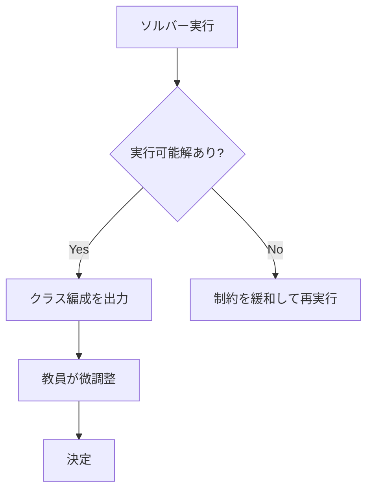

# 結果と考察

## 計算量の比較

| 方法 | 時間 | 備考 |
|------|------|------|
| 全探索 | 事実上不可能 | 組み合わせ数 $\approx 10^{130}$ |
| 手作業 | 数時間〜数日 | ベテラン教員でも困難 |
| CP-SAT ソルバー | **1秒以内** | 制約が複雑でも対応可 |

---

## 結果の見方

ソルバーが「解なし」と返した場合、制約が厳しすぎる可能性があります。
たとえば「避けたいペアが多すぎる」など。制約を段階的に緩めて試します。

---

## 発展的な話題

### より複雑な目的関数

実際の学校現場では、さらに多くの条件が加わります：

- **部活のバランス**: 各部活の主力選手が分散するよう
- **学力層の分散**: テストのスコア帯が各クラスで均等に
- **過去のクラスメート**: 昨年同じクラスだった生徒は分けるなど

これらも同様に 0-1 変数と線形制約で表現できます。

### 多目的最適化

複数の目標（人数バランス・男女バランス・学力バランス）を
**同時に最適化**したい場合は、**重み付き目的関数**を使います：

$$
\text{minimize} \quad w_1 f_1 + w_2 f_2 + w_3 f_3
$$

ここで $f_1, f_2, f_3$ はそれぞれのバランスの「悪さ」を測る指標、
$w_1, w_2, w_3$ は優先度の重みです。

---

## 数理最適化が使われている身近な例

!!! example "実際の応用例"
    - ✈️ **航空会社のスケジューリング**: 乗務員の勤務割り当て
    - 🏥 **病院の人員配置**: 看護師のシフト管理
    - 📦 **物流**: トラックの積み込みと配送ルート
    - 📡 **通信**: 電波の周波数割り当て

クラス替えは、これらと同じ「**割り当て問題（Assignment Problem）**」の一種です。

---

## まとめ

- クラス替えは $10^{130}$ 通りの組み合わせを持つ困難な問題
- 整数計画法で「変数・制約・目的関数」として定式化できる
- OR-tools CP-SAT ソルバーを使えば 1 秒以内に解ける
- 現実の複雑な条件も、線形制約として追加できる

!!! quote "数学の力"
    「最適化」は現代社会の至るところで使われています。
    高校数学で学ぶ「連立不等式」の考え方がその基礎になっています。
